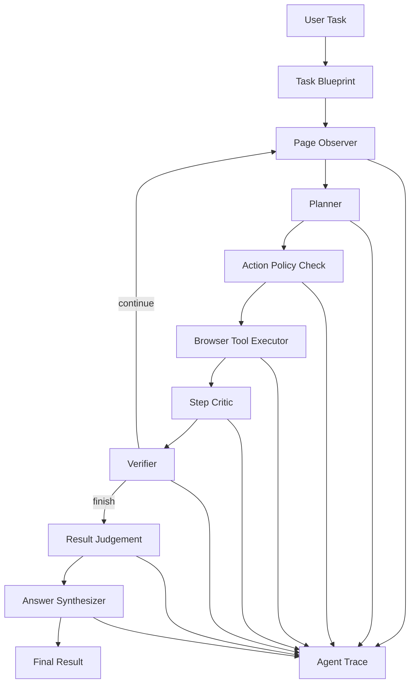

# WebTask Agent

浏览器任务自动化与执行追踪系统。项目面向网页检索、表单填写、信息抽取等多步骤浏览器任务，将自然语言任务转化为可执行的浏览器动作，并完整记录 Agent 的观察、决策、工具调用、失败恢复和最终结果。

该项目强调两个目标：

- 可执行：通过 Playwright 控制真实浏览器，支持稳定的本地演示和可扩展的通用网页任务。
- 可观测：通过 Trace 记录每个节点的输入、输出、耗时、截图、错误和 AI 判断，便于复盘 Agent 的行为链路。

## 核心能力

- 自然语言任务输入：用户输入一句浏览器任务描述即可启动执行流程。
- 页面结构化观察：抽取标题、URL、正文摘要、链接、按钮、输入框和可操作元素，避免直接把完整 DOM 交给模型。
- 受控工具执行：将浏览器能力封装为白名单工具，并通过 Pydantic Schema 校验工具名和参数。
- LLM-first Planner：配置大模型后，由模型根据页面观察和历史 Trace 选择下一步动作；未配置时使用规则兜底。
- AI 认知节点：在执行前、中、后分别进行任务分析、动作风险评估、步骤批判、失败反思、结果判定和答案生成。
- 执行追踪系统：所有节点事件写入 SQLite，支持 Trace 查询、截图回放、失败分类和 Markdown 报告导出。
- 评测闭环：内置本地测试页面和小规模任务集，统计成功率、平均步骤数、平均耗时和失败类型分布。
- 可视化演示：通过 Streamlit 展示任务输入、运行结果、AI Workbench、Trace 时间线、截图和统计指标。

## 系统架构



## Agent 工作流

```text
自然语言任务
  -> 任务分析 Task Blueprint
  -> 页面观察 Observer
  -> 动作选择 Planner
  -> 动作策略评估 Action Policy
  -> 浏览器工具执行 Executor
  -> 步骤批判 Step Critic
  -> 状态校验 Verifier
  -> 失败反思 / 重试
  -> 结果判定 Result Judgement
  -> 答案生成 Answer Synthesis
  -> Trace 报告输出
```

## AI Intelligence Layer

项目不仅封装浏览器操作，还显式拆分了 Agent 的认知过程：

| 模块 | 作用 |
| --- | --- |
| Task Blueprint | 分析任务类型、目标、成功标准、建议步骤和风险点 |
| LLM Planner | 基于页面观察、历史动作和恢复建议选择下一步工具 |
| Action Policy Check | 在执行前评估动作置信度、风险等级和预期效果 |
| Step Critic | 在执行后判断当前步骤是否推动任务完成 |
| Failure Reflection | 对定位失败、超时、结果缺失等问题分类并给出恢复策略 |
| Result Judgement | 判断最终结果是否满足用户目标，并给出置信度和缺失项 |
| Answer Synthesizer | 基于 Trace 证据生成面向用户的最终回答 |

没有配置大模型时，上述模块会使用启发式逻辑兜底，保证项目可以离线演示；配置 `OPENAI_API_KEY` 后，`hybrid` 和 `llm` 模式会切换为 OpenAI 兼容模型驱动。

## 技术栈

```text
Python / FastAPI / Playwright / LangGraph / SQLite / Streamlit / Docker
```

## 目录结构

```text
app/
  agent/
    actions.py        # 工具动作 Schema 与参数校验
    graph.py          # LangGraph Agent 编排
    intelligence.py   # AI 认知层：分析、评估、批判、判定、生成
    planner.py        # 规则 Planner / LLM Planner / Hybrid Planner
    verifier.py       # 执行状态校验
  browser/
    observer.py       # 页面结构化观察
    session.py        # Playwright 浏览器会话
    tools.py          # 浏览器工具封装
  db/
    database.py       # SQLite 访问层
    schema.sql        # 任务表与 Trace 表
  eval/
    cases.json        # 评测任务集
    runner.py         # 评测执行器
  trace/
    recorder.py       # Trace 写入
    analyzer.py       # Trace 分析与报告
frontend/
  streamlit_app.py    # 演示控制台
static/pages/         # 本地稳定演示页面
```

## 浏览器工具

当前支持的受控工具集：

```text
open_url / click / click_by_text / type_text / type_by_selector / type_by_label
select_option / hover / press / wait / wait_for_text / scroll / go_back
extract_text / extract_links / extract_table / current_page / screenshot / finish
```

所有工具调用都会记录：

```text
tool name
arguments
output
screenshot path
success flag
error message
cost_ms
```

## Trace 数据模型

核心表包括任务运行表和 Agent Trace 表：

```text
task_run
  id
  user_task
  status
  final_result
  error_message
  start_time
  end_time

agent_trace
  id
  task_id
  step_index
  node_name
  action_type
  action_input
  observation
  screenshot_path
  success
  error_message
  cost_ms
  create_time
```

Trace 报告会汇总：

```text
执行状态
最终结果
执行步骤数
Trace 事件数
工具调用分布
节点调用分布
失败类型分布
截图数量
AI 任务分析
AI 动作策略评估
AI 步骤批判
AI 失败反思
AI 结果判定
AI 答案生成
Agent Depth Score
Markdown 报告
```

## 快速开始

### 1. 安装依赖

```bash
python -m venv .venv
.venv\Scripts\activate
pip install -r requirements.txt
playwright install chromium
```

### 2. 配置环境变量

复制示例配置：

```bash
copy .env.example .env
```

最小配置：

```text
WEBTASK_PLANNER=hybrid
WEBTASK_HEADLESS=true
```

启用大模型：

```text
OPENAI_API_KEY=<your-openai-api-key>
OPENAI_MODEL=gpt-4o-mini
```

如需接入 OpenAI 兼容服务：

```text
OPENAI_BASE_URL=<openai-compatible-base-url>
```

接口只返回大模型是否已配置，不会返回密钥内容。

### 3. 启动 API

```bash
uvicorn app.main:app --reload --host 0.0.0.0 --port 8000
```

API 文档：

```text
http://localhost:8000/docs
```

### 4. 启动演示页面

```bash
streamlit run frontend/streamlit_app.py
```

访问：

```text
http://localhost:8501
```

## API 接口

```text
GET  /api/health
GET  /api/config
POST /api/tasks/run
GET  /api/tasks
GET  /api/tasks/{task_id}/trace
GET  /api/tasks/{task_id}/result
GET  /api/tasks/{task_id}/report
```

示例请求：

```bash
curl -X POST http://localhost:8000/api/tasks/run ^
  -H "Content-Type: application/json" ^
  -d "{\"task\":\"打开本地搜索页面，搜索 Spring AI 工具调用，提取前三条结果标题和链接\",\"planner_mode\":\"hybrid\"}"
```

## 演示任务

```text
打开本地搜索页面，搜索 Spring AI 工具调用，提取前三条结果标题和链接
打开本地测试表单页面，填写姓名测试用户甲、手机号13000000001并提交
打开本地商品列表页面，提取价格最低的商品名称
```

## Planner 模式

```text
rule   : 规则 Planner，适合稳定演示和评测
llm    : 仅使用大模型 Planner，需要配置 OPENAI_API_KEY
hybrid : 默认模式，优先使用大模型，不可用时自动回退到规则 Planner
```

Planner 输出必须满足统一 JSON 动作格式：

```json
{
  "tool": "type_text",
  "args": {
    "selector_or_text": "搜索关键词",
    "text": "Spring AI 工具调用"
  },
  "reason": "Fill the search input with the requested query."
}
```

## 评测

先启动 API，再运行：

```bash
python -m app.eval.runner --api-base http://localhost:8000
```

评测指标：

```text
任务成功率
平均执行步数
平均耗时
失败类型分布
AI 判定是否通过
AI 判定置信度
Agent Depth Score
```

## Docker

```bash
docker build -t webtask-agent .
docker run --rm -p 8000:8000 webtask-agent
```

## 安全与可控性设计

- 工具白名单：模型只能选择系统定义的浏览器工具。
- 参数 Schema 校验：非法工具名、缺失参数、错误参数会被拦截。
- 最大步数限制：避免 Agent 无限循环。
- 失败重试：工具执行失败后会重试，并在连续失败后终止。
- 失败反思：失败信息写入 Trace，辅助定位页面变化、元素定位失败和超时问题。
- 密钥隔离：`.env` 不提交到仓库，配置接口不返回密钥明文。

## 项目亮点

- 基于 LangGraph 将浏览器 Agent 拆分为可追踪节点，形成清晰的 Agent 执行链路。
- 使用结构化页面观察替代完整 DOM 输入，降低上下文噪声并提升 Planner 决策稳定性。
- 引入 Action Policy 和 Step Critic，使系统能够解释“为什么执行这一步”和“这一步是否有效”。
- 设计 Agent Trace 机制，沉淀动作、观察、截图、耗时、错误、AI 判断和最终报告。
- 支持 LLM 驱动与规则兜底两种模式，兼顾通用能力和本地演示稳定性。
- 构建评测闭环，从成功率、执行步数、耗时、失败分布和 AI 置信度评估 Agent 效果。
