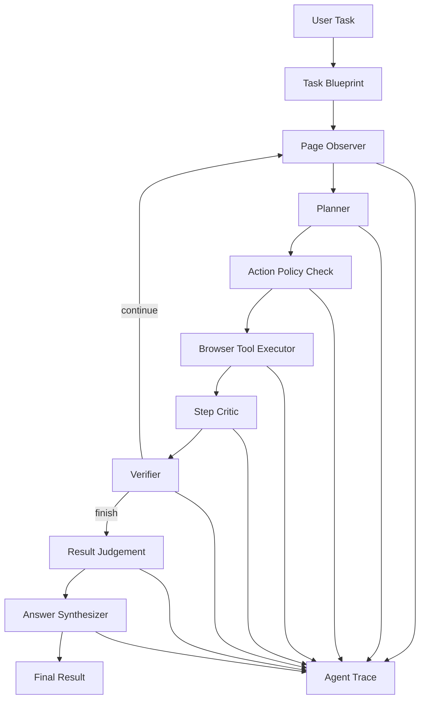

# WebTask Agent：浏览器任务自动化与执行追踪系统

我做这个项目的初衷不是简单封装几个 Playwright 脚本，而是想把“浏览器 Agent 到底是怎么思考、怎么行动、怎么失败、又怎么复盘的”这件事做得清楚一点。

很多浏览器自动化 Demo 只能展示最后成功了没有，但中间每一步为什么点这里、为什么输入这里、失败时发生了什么，往往看不见。WebTask Agent 更关注这条执行链路本身：用户输入一句自然语言任务后，系统会观察页面、规划动作、调用浏览器工具、校验结果，并把每一步完整写进 Trace。

例如输入：

```text
打开本地搜索页面，搜索 Spring AI 工具调用，提取前三条结果标题和链接
```

系统会自动打开页面、输入关键词、提交搜索、提取结果，并生成可复盘的执行报告。

## 我在这个项目里重点做了什么

我把整个 Agent 拆成了几个相对清晰的模块，而不是让一个“大模型黑盒”直接控制浏览器：

- 页面观察：只抽取标题、URL、正文摘要、链接、按钮、输入框和可操作元素，而不是把完整 DOM 一股脑塞给模型。
- 动作规划：支持规则 Planner、LLM Planner 和 Hybrid Planner，既能稳定演示，也能在配置大模型后处理更泛化的网页任务。
- 工具执行：把浏览器操作封装成白名单工具，例如打开网页、点击、输入、提取文本、提取链接、截图等。
- 动作校验：每次工具调用前后都会经过动作风险评估、步骤批判和结果校验。
- 执行追踪：所有观察、决策、动作、截图、耗时、异常和 AI 判断都会写入 SQLite。
- 评测闭环：内置本地搜索、表单、商品列表页面和任务集，用成功率、步骤数、耗时、失败类型来评估效果。

## 项目亮点

### 1. 不是“脚本式自动化”，而是可追踪的 Agent 流程

我没有把任务写死成固定脚本，而是用 LangGraph 把流程拆成了：

```text
Task Blueprint
  -> Observer
  -> Planner
  -> Action Policy
  -> Executor
  -> Step Critic
  -> Verifier
  -> Result Judgement
  -> Answer Synthesis
```

这样做的好处是每个节点都有明确职责，也都能被 Trace 记录。后续如果某一步失败，可以直接看到是页面观察不够、Planner 决策不准、元素定位失败，还是最终结果不满足任务要求。

### 2. 页面观察做了结构化抽取

浏览器页面的 DOM 通常非常长，直接丢给模型会带来大量噪声，也会浪费上下文。我这里选择先做一层轻量观察：

```text
title
url
body_text
links
buttons
inputs
actionable_elements
```

这样 Planner 拿到的是“页面当前能做什么”的摘要，而不是一整页杂乱 HTML。这个设计让模型更容易选择稳定的 selector、文本、label 或 placeholder，也方便在 Trace 里复盘当前页面状态。

### 3. 工具调用是受控的

我没有让模型自由生成任意代码，而是限制它只能选择系统提供的浏览器工具：

```text
open_url / click / click_by_text / type_text / type_by_selector / type_by_label
select_option / hover / press / wait / wait_for_text / scroll / go_back
extract_text / extract_links / extract_table / current_page / screenshot / finish
```

所有动作都会经过 `AgentAction` Schema 校验。工具名不合法、参数缺失、参数格式不对，都会在真正执行前被拦住。这样能减少大模型幻觉工具和错误参数带来的执行风险。

### 4. 我给 Agent 加了一层“自我复盘”

为了让项目更像一个 AI Agent，而不是普通自动化工具，我加了一个独立的 AI Intelligence Layer：

| 模块 | 作用 |
| --- | --- |
| Task Blueprint | 分析任务类型、目标、成功标准、建议步骤和风险点 |
| Action Policy Check | 执行前评估动作置信度、风险等级和预期效果 |
| Step Critic | 执行后判断这一步是否真的推动任务完成 |
| Failure Reflection | 失败后分类原因，并给出恢复策略 |
| Result Judgement | 判断最终结果是否满足用户目标 |
| Answer Synthesizer | 基于 Trace 证据生成最终回答 |

如果配置了 `OPENAI_API_KEY`，这些模块会走大模型；如果没有配置，也会使用启发式策略兜底，保证本地演示不依赖外部服务。

### 5. Trace 是项目的核心，不是附属日志

我希望这个系统不仅能“跑完任务”，还能说清楚“它是怎么跑的”。所以每一步都会记录：

```text
step_index
node_name
action_type
action_input
observation
screenshot_path
success
error_message
cost_ms
```

最终报告会进一步统计工具调用分布、节点分布、失败类型、截图数量、AI 判定结果和 Agent Depth Score。这个 Trace 机制也是这个项目在简历里最容易讲清楚的地方。

## 系统架构



## 当前支持的任务

第一版我没有追求“任何网页都能百分百操作”，而是先把 MVP 做稳，主要覆盖三类任务：

```text
网页检索
表单填写
信息抽取
```

本地内置了三个稳定演示页面：

```text
static/pages/search.html
static/pages/form.html
static/pages/products.html
```

这样做是为了避免演示完全依赖真实网站结构。真实网站可以变，本地评测页面要稳定，这样才能持续验证 Agent 的核心链路。

## 技术栈

```text
Python / FastAPI / Playwright / LangGraph / SQLite / Streamlit / Docker
```

## 目录结构

```text
app/
  agent/
    actions.py        # 工具动作 Schema 与参数校验
    graph.py          # LangGraph Agent 编排
    intelligence.py   # AI 认知层
    planner.py        # Rule / LLM / Hybrid Planner
    verifier.py       # 执行状态校验
  browser/
    observer.py       # 页面结构化观察
    session.py        # Playwright 浏览器会话
    tools.py          # 浏览器工具封装
  db/
    database.py       # SQLite 访问层
    schema.sql        # 任务表与 Trace 表
  eval/
    cases.json        # 评测任务集
    runner.py         # 评测执行器
  trace/
    recorder.py       # Trace 写入
    analyzer.py       # Trace 分析与报告
frontend/
  streamlit_app.py    # Streamlit 演示页面
static/pages/         # 本地测试页面
```

## 快速开始

### 1. 安装依赖

```bash
python -m venv .venv
.venv\Scripts\activate
pip install -r requirements.txt
playwright install chromium
```

### 2. 配置环境变量

复制示例配置：

```bash
copy .env.example .env
```

最小配置：

```text
WEBTASK_PLANNER=hybrid
WEBTASK_HEADLESS=true
```

启用大模型：

```text
OPENAI_API_KEY=<your-openai-api-key>
OPENAI_MODEL=gpt-4o-mini
```

如果使用 OpenAI 兼容服务，可以额外配置：

```text
OPENAI_BASE_URL=<openai-compatible-base-url>
```

配置接口只会返回是否已配置大模型，不会返回密钥明文。

### 3. 启动 FastAPI

```bash
uvicorn app.main:app --reload --host 0.0.0.0 --port 8000
```

接口文档：

```text
http://localhost:8000/docs
```

### 4. 启动 Streamlit

```bash
streamlit run frontend/streamlit_app.py
```

演示页面：

```text
http://localhost:8501
```

## API 接口

```text
GET  /api/health
GET  /api/config
POST /api/tasks/run
GET  /api/tasks
GET  /api/tasks/{task_id}/trace
GET  /api/tasks/{task_id}/result
GET  /api/tasks/{task_id}/report
```

示例请求：

```bash
curl -X POST http://localhost:8000/api/tasks/run ^
  -H "Content-Type: application/json" ^
  -d "{\"task\":\"打开本地搜索页面，搜索 Spring AI 工具调用，提取前三条结果标题和链接\",\"planner_mode\":\"hybrid\"}"
```

## 可以直接演示的任务

```text
打开本地搜索页面，搜索 Spring AI 工具调用，提取前三条结果标题和链接
打开本地测试表单页面，填写姓名测试用户甲、手机号13000000001并提交
打开本地商品列表页面，提取价格最低的商品名称
```

## Planner 模式

```text
rule   : 只使用规则 Planner，适合稳定演示和评测
llm    : 只使用大模型 Planner，需要配置 OPENAI_API_KEY
hybrid : 默认模式，优先使用大模型，不可用时自动回退到规则 Planner
```

Planner 输出统一为 JSON 动作：

```json
{
  "tool": "type_text",
  "args": {
    "selector_or_text": "搜索关键词",
    "text": "Spring AI 工具调用"
  },
  "reason": "Fill the search input with the requested query."
}
```

## 评测

先启动 API，再运行：

```bash
python -m app.eval.runner --api-base http://localhost:8000
```

评测指标包括：

```text
任务成功率
平均执行步数
平均耗时
失败类型分布
AI 判定是否通过
AI 判定置信度
Agent Depth Score
```

## Docker

```bash
docker build -t webtask-agent .
docker run --rm -p 8000:8000 webtask-agent
```

## 安全与可控性设计

- 工具白名单：模型不能调用未定义工具。
- 参数校验：所有动作执行前必须通过 Pydantic Schema。
- 最大步数限制：避免 Agent 陷入无限循环。
- 失败重试：工具执行失败后会重试，连续失败后终止任务。
- 失败反思：失败原因会写入 Trace，便于定位和恢复。
- 密钥隔离：`.env` 不提交到仓库，配置接口不返回密钥明文。

## 我对这个项目的定位

这个项目不是为了证明“浏览器 Agent 已经能处理所有网页”，而是为了把一个 Agent 从任务输入到动作执行、从失败恢复到结果评估的完整工程链路做出来。

它适合作为一个可演示、可复盘、可扩展的 AI Agent 项目：既能展示 Playwright 自动化能力，也能展示 LangGraph 编排、工具调用约束、Trace 可观测性、失败分析和评测闭环。
